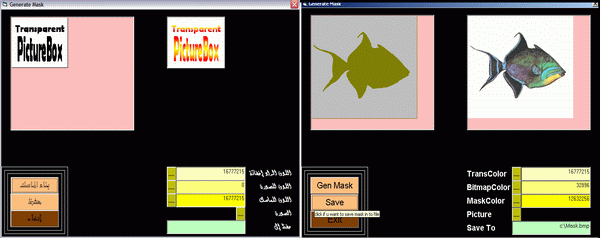



## Generate  Mask

### Description

This project with Class to generate a mask for bitmap and u can save the mask on disk

u can do any color for mask :

U can define any color to be transparent, NOT ONLY WHITE

U can define any color to be on Bitmap Bixel "Real Image" ,NOT ONLY BLACK

U can define any color too to be in the transparent pixel ,NOT ONLY WHITE

so , u can use white and black or u can choose any color else u want

i wish this be useful to u

pls vote for me
 
### More Info
 

             |
---                |---
**Submitted On**   |2005-04-12 11:52:22
**By**             |[wael owida](https://github.com/Planet-Source-Code/PSCIndex/blob/master/ByAuthor/wael-owida.md)
**Level**          |Intermediate
**User Rating**    |4.2 (21 globes from 5 users)
**Compatibility**  |VB 5\.0, VB 6\.0
**Category**       |[Graphics](https://github.com/Planet-Source-Code/PSCIndex/blob/master/ByCategory/graphics__1-46.md)
**World**          |[Visual Basic](https://github.com/Planet-Source-Code/PSCIndex/blob/master/ByWorld/visual-basic.md)
**Archive File**   |[Generate\_\_1876554142005\.zip](https://github.com/Planet-Source-Code/wael-owida-generate-mask__1-59966/archive/master.zip)

